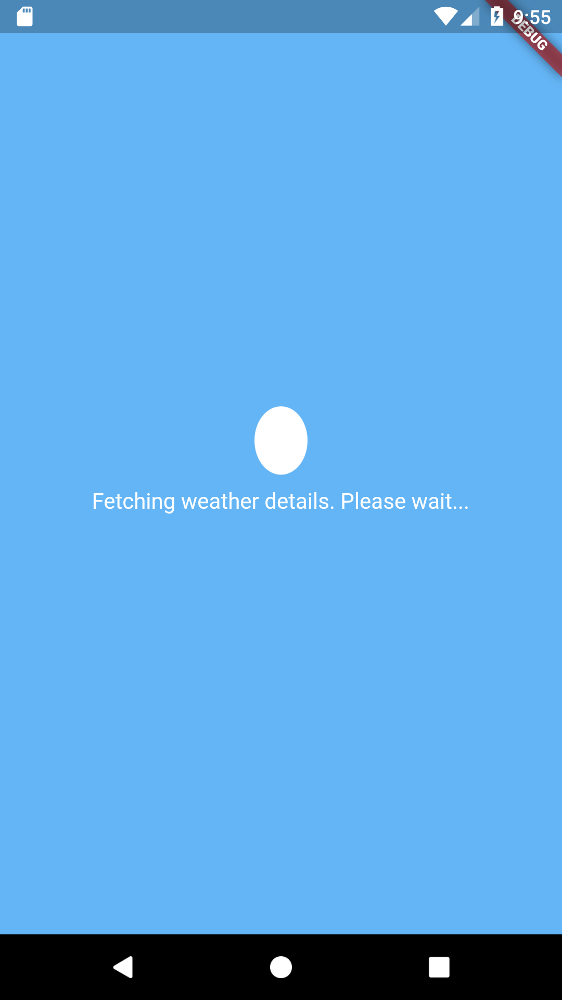
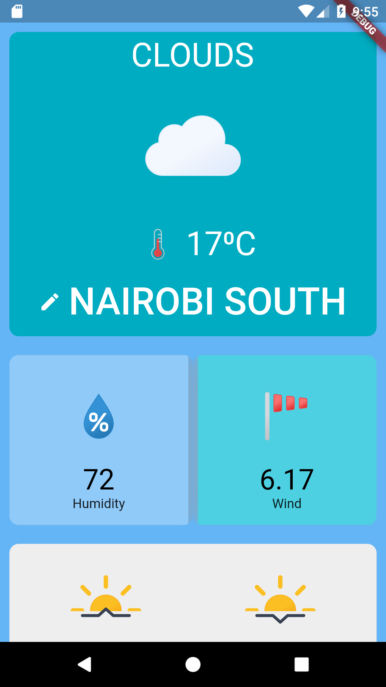
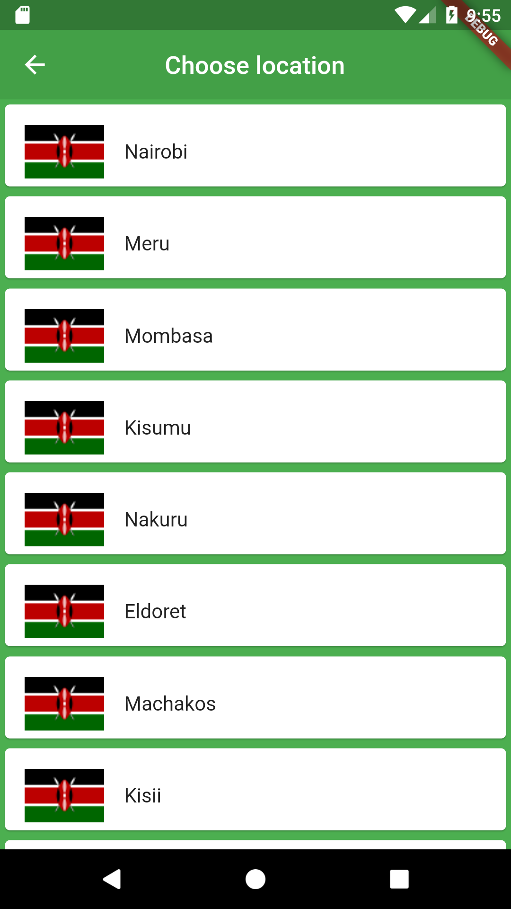

# Hali ya Anga

A mobile application that basically tells the weather: date, temperature, humidity, wind, sunrise and sunset of a specified place.

## Application Navigation

The application has 3 pages (see below with screenshots):

### 1.Loading page

This is the page that allows fetching of weather data to display on the home page.

### 2.Home page

This is the default mainscreen of the application that displays the weather data of the desired location.

### 3.Locations Page

This is the page that displays possible locations (only in Kenya at the moment) that provide weather details for replacing the default weather conditions for the home page.

## Delivery time

The application has been constructed in about 2 days from designing on figma to coding and debugging. 
Start date: 22nd January 2023
End date: 23rd January 2023

## Updates

The application will be periodically updated and improved with subsequent knowledge gain in flutter so as to enhance it; improve loading time, increase the number of locations it can handle.